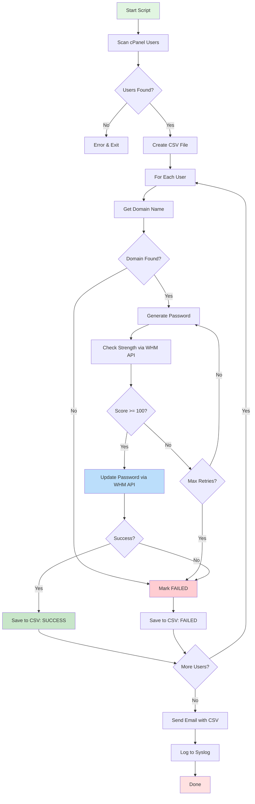

# 🔐 cPanel Password Rotator

[](https://opensource.org/licenses/MIT)
[](https://www.gnu.org/software/bash/)
[](https://cpanel.net/)

> Automatic password rotation for all cPanel accounts with email notifications and CSV export.

## 🎯 What It Does

This Bash script automatically:
- 📋 Finds all cPanel user accounts
- 🔐 Generates strong random passwords (28 characters)
- ✅ Validates password strength via WHM API (100/100 score)
- 🔄 Updates passwords using WHM API
- 📊 Creates CSV file with results
- 📧 Emails summary with CSV attachment

## 📊 How It Works



## 📦 Requirements

- **Server:** cPanel/WHM installed
- **Access:** Root privileges
- **Mail:** Sendmail or working mail system
- **Shell:** Bash 4.0+

## 🚀 Installation

### 1. Clone Repository

```bash
git clone https://github.com/souravkr529/cpanel-password-rotator.git
cd cpanel-password-rotator
```

### 2. Setup Script

```bash
# Create directory
mkdir -p /root/scripts

# Copy script
cp password_change.sh /root/scripts/

# Set permissions
chmod 700 /root/scripts/password_change.sh
```

### 3. Configure Email

Edit the script and update your email:

```bash
nano /root/scripts/password_change.sh
```

Change line 4:
```bash
ADMIN_EMAIL="your-email@example.com"
```

## 💻 Usage

### Run Manually

```bash
/root/scripts/password_change.sh
```

### Automate with Cron

```bash
# Edit crontab
crontab -e

# Run every month on 26th at 11:55 PM
55 23 26 * * /root/scripts/password_change.sh > /dev/null 2>&1
```

## 📁 Output

### CSV File Format

| domain | username | new_password | status |
|--------|----------|--------------|---------|
| example.com | user1 | Abc123XyzPqr456MnoUvw789Klm | SUCCESS |
| test.com | user2 | Xyz789DefGhi012JklMno345Pqr | SUCCESS |
| demo.com | user3 | | FAILED |

**Location:** `/root/password-rotations/whm_passwords_YYYY-MM-DD_HHMMSS.csv`  
**Permissions:** `600` (owner read/write only)

### Email Notification

You'll receive an email with:
- Summary (total users, success, failed)
- Failed accounts list with reasons
- CSV file as attachment (base64 encoded)

## ⚙️ Configuration

Edit these variables in the script:

```bash
PASSWORD_LENGTH=28      # Password length (24-32 recommended)
TARGET_STRENGTH=100     # WHM strength score (0-100)
MAX_GEN_TRIES=80        # Max password generation attempts
MAX_API_TRIES=3         # Max API retry attempts
```

## 🔒 Security Features

- ✅ Cryptographically secure password generation (`/dev/urandom`)
- ✅ Strong passwords: 28 chars, alphanumeric (A-Z, a-z, 0-9)
- ✅ Password strength validation (100/100 score)
- ✅ Secure file permissions (600 for CSV/logs, 700 for directory)
- ✅ No passwords in email body or system logs
- ✅ Passwords only in encrypted CSV attachment

## 🐛 Troubleshooting

### No Users Found

```bash
# Check if cPanel user files exist
ls -la /var/cpanel/users/
```

### Email Not Received

```bash
# Test sendmail
echo "Test" | mail -s "Test" your-email@example.com

# Check mail logs
tail -f /var/log/maillog
```

### Permission Denied

```bash
# Run as root
sudo /root/scripts/password_change.sh
```

## 📝 Example Cron Schedules

```bash
# Every Sunday at 2 AM
0 2 * * 0 /root/scripts/password_change.sh > /dev/null 2>&1

# Every 3 months (quarterly)
0 0 1 */3 * /root/scripts/password_change.sh > /dev/null 2>&1

# Every 6 months
0 3 1 */6 * /root/scripts/password_change.sh > /dev/null 2>&1
```

## 📄 License

MIT License - see [LICENSE](LICENSE) file

## 👨‍💻 Author

**Sourav Kumar**
- Email: souravkr529@gmail.com
- GitHub: [@souravkr529](https://github.com/souravkr529)

## ⭐ Support

If this helped you, please star the repository!

---

**Made with ❤️ for cPanel administrators**
