# 🔐 cPanel Auto Password Change & Rotation

[](https://opensource.org/licenses/MIT)
[](https://www.gnu.org/software/bash/)
[](https://cpanel.net/)
[](https://github.com/yourusername/cpanel-auto-password-change)

> **Secure, automated password rotation for cPanel/WHM accounts with email notifications and detailed logging.**

## 📋 Table of Contents

- [Overview](#overview)
- [How It Works](#how-it-works)
- [Script Flow Diagram](#script-flow-diagram)
- [Features](#features)
- [Security](#security)
- [Requirements](#requirements)
- [Installation](#installation)
- [Configuration](#configuration)
- [Usage](#usage)
- [Automation with Cron](#automation-with-cron)
- [Output Files](#output-files)
- [Email Notifications](#email-notifications)
- [Troubleshooting](#troubleshooting)
- [Contributing](#contributing)
- [License](#license)
- [Author](#author)

## 🎯 Overview

**cPanel Auto Password Change** is a robust Bash script designed for system administrators to automate password rotation for all cPanel accounts on a WHM server. It ensures strong password generation, validates password strength using WHM API, and sends detailed reports via email with CSV attachments containing the new credentials.

### Why Use This Script?

- ✅ **Enhanced Security**: Regular password rotation reduces security risks
- ✅ **Compliance**: Meets industry standards for password management
- ✅ **Automation**: Set it and forget it with cron scheduling
- ✅ **Auditability**: Complete logging and CSV export of all operations
- ✅ **Email Reports**: Automatic notifications with detailed summaries
- ✅ **Safe & Tested**: Production-ready with error handling and validation

## 🔄 How It Works

The script automates the entire password rotation process through these key steps:

### Quick Process Overview

1. **Discovery** → Finds all cPanel user accounts
2. **Generation** → Creates strong random passwords
3. **Validation** → Checks password strength via WHM API
4. **Update** → Changes passwords using WHM API
5. **Recording** → Saves results to CSV file
6. **Notification** → Emails summary with CSV attachment

### Detailed Workflow


## 📊 Script Flow Diagram

### Complete Execution Flow


### Password Generation & Validation Flow

```mermaid
stateDiagram-v2
    [*] --> GeneratePassword
    
    GeneratePassword --> ValidateFormat: Generate random<br/>A-Z, a-z, 0-9
    
    ValidateFormat --> CheckLowercase: Check if password<br/>has lowercase
    CheckLowercase --> CheckUppercase: Has lowercase ✓
    CheckLowercase --> GeneratePassword: Missing lowercase ✗
    
    CheckUppercase --> CheckDigit: Has uppercase ✓
    CheckUppercase --> GeneratePassword: Missing uppercase ✗
    
    CheckDigit --> CheckStrength: Has digit ✓
    CheckDigit --> GeneratePassword: Missing digit ✗
    
    CheckStrength --> WHM_API: Send to WHM API<br/>get_password_strength
    
    WHM_API --> EvaluateScore: Receive strength<br/>score (0-100)
    
    EvaluateScore --> SetPassword: Score >= 100 ✓
    EvaluateScore --> RetryGeneration: Score < 100 ✗
    
    RetryGeneration --> CheckRetries: Increment counter
    CheckRetries --> GeneratePassword: Tries < MAX_GEN_TRIES
    CheckRetries --> Failed: Tries >= MAX_GEN_TRIES
    
    SetPassword --> API_Call: WHM API passwd
    
    API_Call --> CheckResult: Parse JSON response
    
    CheckResult --> Success: result = 1 ✓
    CheckResult --> RetryAPI: result = 0 ✗
    
    RetryAPI --> CheckAPIRetries: Check retry count
    CheckAPIRetries --> API_Call: Retries < MAX_API_TRIES
    CheckAPIRetries --> Failed: Retries >= MAX_API_TRIES
    
    Success --> [*]: Password Changed ✓
    Failed --> [*]: Password Change Failed ✗
    
    note right of GeneratePassword
        Uses /dev/urandom
        28 characters default
        Only safe chars
    end note
    
    note right of WHM_API
        API: get_password_strength
        Target: 100/100 score
    end note
    
    note right of API_Call
        API: passwd
        Max 3 retries
    end note
```



### Output Generation Process


### File Structure & Output

```mermaid
graph TB
    subgraph "Input Files"
        A1[/var/cpanel/users/user1]
        A2[/var/cpanel/users/user2]
        A3[/var/cpanel/users/userN]
    end
    
    subgraph "Script"
        B[password_change.sh<br/>Main Script]
    end
    
    subgraph "Output Directory<br/>/root/password-rotations/"
        C1[whm_passwords_2024-12-30_235500.csv]
        C2[whm_passwords_2024-12-30_235500.log]
        C3[whm_passwords_2024-11-26_235500.csv]
        C4[whm_passwords_2024-11-26_235500.log]
    end
    
    subgraph "Email Notification"
        D1[To: admin@example.com]
        D2[Subject: WHM Password Changed]
        D3[Body: Summary Report]
        D4[Attachment: CSV File<br/>base64 encoded]
    end
    
    subgraph "System Logs"
        E1[/var/log/messages<br/>Syslog entries]
    end
    
    A1 --> B
    A2 --> B
    A3 --> B
    
    B --> C1
    B --> C2
    
    C1 --> D4
    B --> D1
    B --> D2
    B --> D3
    
    B --> E1
    
    style B fill:#4CAF50,color:#fff
    style C1 fill:#2196F3,color:#fff
    style D4 fill:#FF9800,color:#fff
```

### CSV Output Format Example

The script generates a CSV file with the following structure:

| domain | username | new_password | status |
|--------|----------|--------------|---------|
| example.com | exampleuser | Abc123XyzPqr456MnoUvw789Klm | SUCCESS |
| test.com | testuser | Xyz789DefGhi012JklMno345Pqr | SUCCESS |
| demo.com | demouser | | FAILED |

**File Details:**
- **Filename Format**: `whm_passwords_YYYY-MM-DD_HHMMSS.csv`
- **Location**: `/root/password-rotations/`
- **Permissions**: `600` (owner read/write only)
- **Encoding**: UTF-8
- **Delimiter**: Comma (,)

## ✨ Features

### 🔒 Security Features

- **Strong Password Generation**: Generates alphanumeric passwords (A-Z, a-z, 0-9) with configurable length (default: 28 characters)
- **Password Strength Validation**: Uses WHM API `get_password_strength` to ensure passwords meet minimum strength requirements (default: 100/100)
- **Secure Storage**: Output files are created with strict permissions (600)
- **Safe Character Set**: Avoids special characters that might cause parsing issues with WHM CLI

### 🚀 Automation Features

- **Bulk Processing**: Automatically processes all cPanel accounts
- **Retry Logic**: Configurable retry attempts for password generation and API calls
- **Domain Auto-Detection**: Automatically retrieves associated domain for each user
- **Comprehensive Logging**: Detailed logs for troubleshooting and auditing
- **Email Notifications**: Sends summary with CSV attachment to administrators

### 📊 Reporting Features

- **CSV Export**: Exports all passwords in CSV format (domain, username, password, status)
- **Success/Failure Tracking**: Detailed breakdown of successful and failed operations
- **Email Reports**: Professional email with summary statistics and failed account details
- **Syslog Integration**: Logs events to system logger for centralized monitoring

## 🔐 Security

This script implements multiple security best practices:

1. **Strict File Permissions**: All output files (CSV, logs) are created with `chmod 600` (owner read/write only)
2. **Secure Password Generation**: Uses `/dev/urandom` for cryptographically secure random password generation
3. **No Password Exposure**: Passwords are never logged to system logs; only stored in protected CSV files
4. **Email Encryption**: Passwords are sent as base64-encoded CSV attachments, not in plain email body
5. **Output Directory Protection**: Password rotation directory is created with `chmod 700` (owner access only)

### Security Recommendations

- Store the script in a protected directory (e.g., `/root/scripts/`)
- Limit script execution to root user only
- Use encrypted email (TLS/SSL) for notification delivery
- Regularly rotate admin passwords used to access the CSV files
- Monitor script execution logs for unauthorized access attempts

## 📦 Requirements

- **Operating System**: Linux (tested on CentOS, AlmaLinux, Rocky Linux)
- **Control Panel**: cPanel/WHM (any modern version)
- **Shell**: Bash 4.0 or higher
- **Tools**: Standard Linux utilities (awk, sed, tr, base64, sendmail)
- **Permissions**: Root access required

## 🚀 Installation

### Step 1: Clone the Repository

```bash
git clone https://github.com/yourusername/cpanel-auto-password-change.git
cd cpanel-auto-password-change
```

### Step 2: Move Script to Appropriate Location

```bash
# Create scripts directory (if not exists)
mkdir -p /root/scripts

# Copy the script
cp password_change.sh /root/scripts/

# Set proper permissions
chmod 700 /root/scripts/password_change.sh
chown root:root /root/scripts/password_change.sh
```

### Step 3: Configure Email Address

Edit the script and update the admin email:

```bash
nano /root/scripts/password_change.sh
```

Change this line:
```bash
ADMIN_EMAIL="souravkr529@gmail.com"
```

To your email:
```bash
ADMIN_EMAIL="your-email@example.com"
```

## ⚙️ Configuration

### Configurable Parameters

Edit the script to customize these settings:

```bash
# Output directory (where CSV and logs are stored)
OUT_DIR="/root/password-rotations"

# Admin email (comma-separated for multiple recipients)
ADMIN_EMAIL="admin@example.com,security@example.com"

# Password policy
PASSWORD_LENGTH=28        # Recommended: 24-32
TARGET_STRENGTH=100       # WHM strength score (0-100)
MAX_GEN_TRIES=80          # Maximum password generation attempts
MAX_API_TRIES=3           # Maximum API retry attempts
```

### Password Policy Explained

- **PASSWORD_LENGTH**: Length of generated passwords (default: 28 characters)
- **TARGET_STRENGTH**: Minimum WHM password strength score (0-100 scale)
- **MAX_GEN_TRIES**: Maximum attempts to generate a strong password
- **MAX_API_TRIES**: Maximum retry attempts for WHM API calls

## 💻 Usage

### Manual Execution

Run the script manually:

```bash
/root/scripts/password_change.sh
```

### Expected Output

```
===============================================
Password Rotation Summary:
Total users: 15
Success:     14
Failed:      1
CSV File:    /root/password-rotations/whm_passwords_2024-12-30_135500.csv
Log File:    /root/password-rotations/whm_passwords_2024-12-30_135500.log
Email sent to: admin@example.com
===============================================
```

## ⏰ Automation with Cron

### Schedule Monthly Password Rotation

To automate password rotation on the 26th of every month at 11:55 PM:

```bash
# Edit crontab
crontab -e

# Add this line:
55 23 26 * * /root/scripts/password_change.sh > /dev/null 2>&1
```

### Other Useful Cron Schedules

```bash
# Every Sunday at 2 AM
0 2 * * 0 /root/scripts/password_change.sh > /dev/null 2>&1

# Every 3 months (quarterly) on 1st at midnight
0 0 1 */3 * /root/scripts/password_change.sh > /dev/null 2>&1

# Every 6 months on 1st at 3 AM
0 3 1 */6 * /root/scripts/password_change.sh > /dev/null 2>&1
```

### Verify Cron Job

```bash
crontab -l
```

## 📁 Output Files

### Directory Structure

```
/root/password-rotations/
├── whm_passwords_2024-12-30_135500.csv
├── whm_passwords_2024-12-30_135500.log
├── whm_passwords_2024-11-26_235500.csv
└── whm_passwords_2024-11-26_235500.log
```

### CSV Format

```csv
domain,username,new_password,status
example.com,exampleuser,Abc123XyzPqr456MnoUvw789Klm,SUCCESS
test.com,testuser,,FAILED
```

### Log File Contents

Detailed error messages for failed password changes:

```
----- FAILED: testuser (test.com) -----
{"result":"0","reason":"User account is suspended","metadata":{}}
```

## 📧 Email Notifications

### Email Structure

- **Subject**: WHM: Password changed for cPanel users
- **Body**: Summary with success/failure counts and failed account details
- **Attachment**: CSV file with new passwords (base64 encoded)

### Sample Email

```
WHM: Password changed for cPanel users

Account included:
Username: user1
Username: user2
...

CSV Columns: domain,username,new_password,status

Summary:
- Total users: 15
- Success:     14
- Failed:      1

Failed details (no passwords):
- testuser (test.com) : User account is suspended

- Action Date: 2024-12-30 23:55:00
- Performed by: root@server.example.com
- Server: server.example.com (192.168.1.100)
```

## 🔧 Troubleshooting

### Common Issues

#### 1. No cPanel Users Found

**Error**: `ERROR: No cPanel users found in /var/cpanel/users`

**Solution**: Verify cPanel is properly installed and user files exist:
```bash
ls -la /var/cpanel/users/
```

#### 2. Email Not Received

**Possible Causes**:
- Sendmail not configured
- Email marked as spam
- Invalid email address

**Solution**:
```bash
# Test sendmail
echo "Test email" | mail -s "Test" your-email@example.com

# Check mail logs
tail -f /var/log/maillog
```

#### 3. Permission Denied

**Error**: Permission issues when creating files

**Solution**: Ensure script runs as root:
```bash
sudo /root/scripts/password_change.sh
```

#### 4. WHM API Errors

**Error**: API calls failing

**Solution**: Check WHM API access:
```bash
/usr/local/cpanel/bin/whmapi1 --output=json version
```

### Debug Mode

For detailed debugging, modify the script to keep verbose output:

```bash
# Run without suppressing output
/root/scripts/password_change.sh
```

## 🤝 Contributing

Contributions are welcome! Please follow these guidelines:

1. **Fork** the repository
2. **Create** a feature branch (`git checkout -b feature/amazing-feature`)
3. **Commit** your changes (`git commit -m 'Add amazing feature'`)
4. **Push** to the branch (`git push origin feature/amazing-feature`)
5. **Open** a Pull Request

### Code Standards

- Follow existing code style
- Add comments for complex logic
- Test thoroughly before submitting
- Update documentation as needed

See [CONTRIBUTING.md](CONTRIBUTING.md) for detailed guidelines.

## 📄 License

This project is licensed under the **MIT License** - see the [LICENSE](LICENSE) file for details.

### MIT License Summary

```
Permission is hereby granted, free of charge, to any person obtaining a copy
of this software and associated documentation files (the "Software"), to deal
in the Software without restriction, including without limitation the rights
to use, copy, modify, merge, publish, distribute, sublicense, and/or sell
copies of the Software...
```

## 👨‍💻 Author

**Sourav Kumar**
- Email: souravkr529@gmail.com
- GitHub: [@yourusername](https://github.com/yourusername)

## 🙏 Acknowledgments

- Thanks to the cPanel/WHM team for their comprehensive API documentation
- Inspired by security best practices from the sysadmin community
- Built with ❤️ for system administrators worldwide

## 📊 Statistics

- **Lines of Code**: ~220
- **Functions**: 5
- **Supported OS**: CentOS, AlmaLinux, Rocky Linux, CloudLinux
- **Tested on**: cPanel/WHM versions 100+

## 🔗 Related Projects

- [cPanel Documentation](https://docs.cpanel.net/)
- [WHM API Documentation](https://api.docs.cpanel.net/)
- [Password Security Best Practices](https://www.nist.gov/password)

## 📸 Screenshots

### Terminal Output


### Email Notification


---

<div align="center">

**⭐ If you find this project useful, please give it a star! ⭐**

Made with ❤️ by Sourav Kumar | [Report Bug](https://github.com/yourusername/cpanel-auto-password-change/issues) | [Request Feature](https://github.com/yourusername/cpanel-auto-password-change/issues)

</div>
